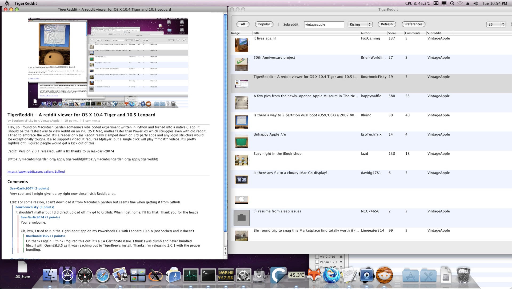

# TigerReddit

A native Reddit client for Mac OS X 10.4 Tiger and 10.5 Leopard on PowerPC.



Browse subreddits, view images, read threaded comments, and watch videos — all from a lightweight Cocoa app that runs on vintage Macs. No web browser needed.

This is a ground-up native C rewrite of [Harry Fornasier's original TigerReddit](https://github.com/harryfornasier/TigerReddit), which used Python for Reddit API access. This version has zero runtime dependencies — just download, unzip, and run.

## What it does

- **Browse Reddit** — view any subreddit with thumbnails, scores, and comment counts
- **Read posts** — double-click to see the full image, post text, and threaded comments
- **Watch videos** — Reddit videos download and open in MPlayer
- **Save images** — right-click any image in a post to save it to your Desktop
- **Configurable** — set your default subreddit, comment depth, and cache age in Preferences

Video playback requires [MPlayer OSX Extended](https://macintoshgarden.org/apps/mplayer-os-x) (free). Everything else works without it.

## System requirements

- Mac OS X 10.4 Tiger or 10.5 Leopard (PowerPC)
- That's it

## Install

Download the latest zip from [Releases](https://github.com/fuzzywalrus/TigerReddit/releases), unzip, and drag `TigerReddit.app` to your Applications folder.

Older browsers like TenFourFox may get stuck on a spinning loader when downloading from GitHub. If that happens, grab it from [Macintosh Garden](https://macintoshgarden.org/apps/tigerreddit) instead.

## Building from source

You need Xcode (2.x on Tiger, 3.x on Leopard) and Tigerbrew with `curl` and `openssl3` installed. See [BUILDING.md](BUILDING.md) for full instructions.

```bash
make
open TigerReddit/TigerReddit.app
```

## Known limitations

- WebP images can't be displayed (Tiger/Leopard don't support the format)
- Some videos require a Reddit account — the app offers to open those in your browser
- Video playback needs MPlayer; QuickTime and VLC 2.0 can't decode Reddit's H.264 on PPC
- This is a reader only — no posting, voting, or searching

## Credits

Original TigerReddit by Harry Fornasier.
Native C port by Greg Gant ([greggant.com](https://greggant.com)).

## License

MIT License — see LICENSE file for details.
